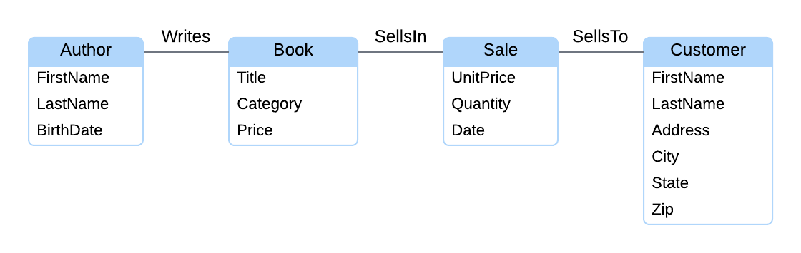
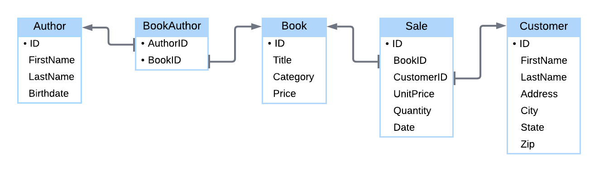

# Chapter 1: Introduction to Databases

## 1.1: Database Basics
### Data
- **Data**: numeric, textual, visual, or audio information describing real world systems
- Collected and processed to aid in a variety of tasks
- Data can vary in multiple ways
  - *Scope*: amount of data produced and collected can vary widely
  - *Format*: data may be produced as numbers, text, images, audio, or video
  - *Access*: some data sources are private, others are publicly available
- Historically, most data was **analog**, with variations on various physical media
- Today most data is **digital**, encoded as ones and zeros on electronic/magnetic media
- Shift from analog to digital data facilitated the rise of large computer databases
### Databases
- **Database**: a collection of structured data, can be stored on a variety of mediums, but modern databases are invariably stored on computers
- Modern databases support trillions of bytes of data and thousands of simultaneous users, so they must be managed with sophisticated tools
  - **Database system**, or a **database management system** (**DBMS**), is software to read/write data in a database
  - **Query** is a request to retrieve or change data in a database. **Query languages** are specialized programming languages designed specifically for database systems
  - **Database application** is software to help users interact with database systems
### Database roles
- **Database administrator**: responsible for securing the database system against unauthorized users
- **Database designer**: determines the format of each data element and overall database structure. Must balance priorities like storage, response time, and governance support
- **Database programmer**: develops computer programs that utilize a database, combining database query languages and general-purpose programming languages
- **Database user**: consumer of data in a database, usually accessing data via applications, but may also submit queries directly

## 1.2: Database Systems
### File systems and database systems
- Small databases may be managed by text files or spreadsheets, but these are inadequate as databases grow larger. These larger databases bring their own special requirements
  - *Performance*: large databases maintain fast response times by structuring data properly and processing queries efficiently
  - *Authorization*: database users need to have limited access to specific tables/columns/rows
  - *Security*: database systems ensure users only access permitted data, as well as encrypt data and restrict access
  - *Rules*: database systems ensure data is consistent with structural and business rules, like referential integrity
  - *Recovery*: database systems must be able to recover from failure and restore the database to a consistent state without loss of data
### Transactions
- **Transaction** is a group of queries that must either be completed or rejected as a whole. Execution of some, but not all, queries can result in inconsistent or incorrect data
- Database systems must
  - *Ensure transactions are processed completely or not at all*, database systems must be able to reverse partial results and restore the values prior to te transaction
  - *Prevent conflicts between concurrent transactions*, if multiple transactions attempt to access the same data at the same time
  - *Ensure transaction results are never lost*, once a transaction completes, the results must be saved on the database's storage media
### Architecture
- The **architecture** of a database system describes the internal components and relationships between those components. Most database systems have similar components at a high level
  - **Query processor** interprets queries, creates plans to modify or retrieve data, and returns query results to the application. The query processor also performs **query optimization** to most efficiently execute instructions on the data
  - **Storage manager** translates query processor instructions into low-level file-system commands to modify or retrieve data. The storage manager may use **indexes** to quickly locate data
  - **Transaction manager** ensures transactions are properly executed, preventing conflicts between concurrent transactions and restoring the database to a consistent state in the event of a failure
  - **Logs** are files with complete records of all inserts/updates/deletes processed by the database, with the transaction manager writing log records before applying changes to the database (these can be used to restore in case of failure)
  - **Catalog**/**data dictionary** is a directory of tables/columns/indexes and other database objects
- Not every database system is the same or implements all of these architecture components
### Products
- A **relational database**, which stores data in tables, columns, and rows (similar to a spreadsheet), is one of the most common type of database system
- All data in a column has the same format and all data in a row represents a single object (such as person, place, or activity)
- All relational database systems support **SQL**, or Structured Query Language. SQL includes statements to read/write data, create/delete tables, and administer the database system
- Relational database systems are very good for databases that require an accurate record of every transaction

## 1.3: Query Languages
### Common queries
- A **query** is a command for a database to insert/retrieve/update/delete data. A **query language** is a programming language for writing database queries
- Four common query types are often referred to as **CRUD** operations; Create, Read, Update, Delete
### Writing queries with SQL
- **Structured Query Language** (or **SQL**) is the standard query language for relational database systems. Often pronounced 'seekwəl' or "ess queue el" ("S-Q-L")
- An SQL **statement** is a complete, executable database command
### Creating tables with SQL
- The SQL **`CREATE TABLE`** statement creates a new table by specifying the table and column names, with each column assigned a **data type**. Possible data types may be numeric, textual, or complex
  - `INT` stores integer values
  - `DECIMAL` stores fractional numeric values
  - `VARCHAR` stores textual values
  - `DATE` stores year, month, and day
- Some data types have numbers in parentheses after them, which indicate the size of the data type, for example `VARCHAR(10)` indicates ten characters, or `DECIMAL(10, 3)` indicates ten significant digits, including three after the decimal

## 1.4: Database Design and Programming
### Conceptual design
- **Database design** is a specification of database objects (tables, columns, data types, indexes, etc.), it also refers to the process of developing that specification
- For small databases, the process can be informal/unstructured. For large, complex databases, the process has three phases
  1. **Conceptual design**: specifies database requirements without regard to any specific database system. Requirements are represented as entities/relationships/attributes. An entity might be a person/place/activity/thing, a relationship is a link between entities, and an attribute is a descriptive property of an entity. May also be called analysis, data modeling, or requirements definition/gathering
     - Entities, relationships, and attributes are depicted in **ER diagrams** (entity relationship diagrams)
     - 
  2. **Logical design**: implements database requirements in a specific database system, converting entities/relationships/attributes into tables/keys/columns. A **key** is a column used to identify individual rows of a table. These tables/keys/columns are specified in SQL with `CREATE TABLE` statements
     - Logical design is depicted in a **table diagram**, similar to an ER diagram, but more detailed
     - Rectangles represent tables, with table names at the top
     - Text within rectangles below the table name represents columns
     - Bullets indicate key columns
     - Arrows between tables indicate columns that refer to keys
     - 
     - This logical design is called a database **schema**
  3. **Physical design**: adds indexes and specifies how tables are stored on storage media. This physical design is specified with SQL statements such as `CREATE INDEX` and, like the logical design, is specific to a database system
     - The physical design may be depicted as a diagram, but the logical design is more important for the database users/programmers
     - While a logical design affects the query result, a physical design impacts the query processing speed (but never the query result itself). This principle of physical design not impacting query results is called **data independence**
     - Data independence allows database designers to tune query performance without changing application programs
### Programming
- Data independence allows for database programming to happen independently of the physical design, at the potential cost of slower performance
- SQL is the standard relational query language but lacks some important programming features (object orientation, etc.)
- To simplify the use of SQL with a general purpose language, database programs usually have an **application programming interface**, or **API**, which helps link a programming language to a database 

## 1.5: MySQL
### MySQL Server
- **MySQL** is a relational database system, sponsored by Oracle, which runs on all major platforms and is one of the most popular database systems

## 1.6: SQL Sandbox