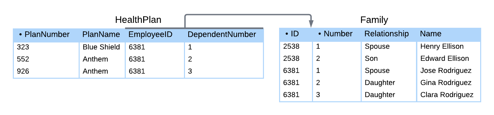

# Chapter 2: Relational Databases

## 2.1: Relational model
### Database models
- A **database model** is a conceptual framework for database systems and contains three parts
  - *Data structures* prescribe how data is organized
  - *Operations* manipulate data structures
  - *Rules* govern valid data
- A **relational model** is a database model based on a tabular data structure, which was published by E.F. Codd in 1970 and released in commercial products around 1980
- Before computer systems became more powerful, network and hierarchical databases were more common. A relational database is much simpler to manage, and as performance of computers improved, they rapidly displaced hierarchical and network database
- Relational databases were initially designed for transactional data, but have gradually adopted support for big data and other alternative database models
- |                | Primary data structure | Initial product releases | Example database system | Strengths                                                 |
  |----------------|------------------------|--------------------------|-------------------------|-----------------------------------------------------------|
  | *Hierarchical* | Tree                   | 1960s                    | IMS                     | Fast queries<br>Efficient storage                         |
  | *Network*      | Linked list            | 1970s                    | IDMS                    | Fast queries<br>Efficient storage                         |
  | *Relational*   | Table                  | 1980s                    | Oracle Database         | Productivity and simplicity<br>Transactional applications |
  | *Object*       | Class                  | 1990s                    | ObjectStore             | Integration with object-oriented programming languages    |
  | *Graph*        | Vertex and edge        | 2000s                    | Neo4j                   | Flexible schema<br>Evolving business requirements         |
  | *Document*     | XML<br>JSON            | 2010s                    | MongoDB                 | Flexible schema<br>Unstructured and semi-structured data  |
### Relational data structure
- Relational data structure is based on set theory, where a **set** is an unordered collection of elements enclosed in braces
  - For example, sets `{a, b, c}` and `{c, b, a}` are the same, as sets are not ordered
- A **tuple** is an ordered collection of elements enclosed in parentheses
  - For example, tuples `(a, b, c)` and `(c, b, a)` are different, since tuples are ordered
- Relational data structure organizes data in tables
  - **Table** has a fixed name, a fixed tuple of columns, and a varying set of rows
  - **Column** has a name and a data type
  - **Row** is an unnamed tuple of values, where each value corresponds to a column and belongs to the column's data type
  - **Data type** is a named set of values, from which column values are drawn
- The rows in a table have no inherent order, since a table is a set of rows
- The terms "table", "column", "row", and "data type" are commonly used in database processing. "Relation", "attribute", "tuple", and "domain" are equivalent mathematical terms, often used in academic literature. "File", "field", "record", and "data type" are similar terms from file processing
- | Databases | Mathematics | Files     |
  |-----------|-------------|-----------|
  | Table     | Relation    | File      |
  | Column    | Attribute   | Field     |
  | Row       | Tuple       | Record    |
  | Data type | Domain      | Data type |
### Relational operations
- Relational operations are based on set theory, with each operation generating a result table from one or two input tables
  - *Select* selects a subset of (or all) rows of a table.
  - *Project* selects one or more columns of a table.
  - *Product* lists all combinations of rows of two tables.
  - *Join* combines two tables by comparing related columns.
  - *Union* selects all rows of two tables.
  - *Intersect* selects rows common to two tables.
  - *Difference* selects rows that appear in one table but not another.
  - *Rename* changes a table name.
  - *Aggregate* computes functions over multiple table rows, such as sum and count.
- These are **relational algebra** operations and are the theoretical foundation of the SQL language
- Relational operations always result in a table, so the result of an SQL query is also a table
### Relational rules
- Rules are logical constraints that ensure data is valid
- **Relational rules** are part of the relational model and govern data in every relational database
  - *Unique primary key*: all tables have a primary key column, or group of columns, in which values may not repeat
  - *Unique column names*: different columns of the same table have different names
  - *No duplicate rows*: No two rows of the same table have identical values in all columns
- **Business rules** are based on business policy and are specific to a particular database
- Relational rules are implemented as SQL **constraints**, whereas business rules are discovered during database design
  - Business rules may be enforced by SQL constraints, but some complex rules must be enforced by applications running on the database

## 2.2: Structured Query Language
### Sublanguages
- **Structured Query Language** (**SQL**) is the query language of relational databases, the preferred pronunciation is 'S-Q-L'
- SQL statements are grouped into five sublanguages
  - **Data Definition Language**
  - **Data Query Language**
  - **Data Manipulation Language**
  - **Data Transaction Language**
  - **Data Control Language**
- | Sublanguage                                                           | Acronym | Example statements                                                                                                | MySQL documentation                                                                                                     |
  |-----------------------------------------------------------------------|---------|-------------------------------------------------------------------------------------------------------------------|-------------------------------------------------------------------------------------------------------------------------|
  | **Data Definition Language**<br>defines database structure.           | **DDL** | <pre><code>CREATE TABLE City (<br>  ID INTEGER,<br>  Name VARCHAR(15),<br>  Population INTEGER<br>);</code></pre> | [Data Definition Statements](https://dev.mysql.com/doc/refman/8.4/en/sql-data-definition-statements.html)               |
  | **Data Query Language**<br>retrieves data.                            | **DQL** | <pre><code>SELECT Name<br>FROM City<br>WHERE Population &gt; 15000;</code></pre>                                  | [Data Manipulation Statements](https://dev.mysql.com/doc/refman/8.4/en/sql-data-manipulation-statements.html)           |
  | **Data Manipulation Language**<br>inserts, updates, and deletes data. | **DML** | <pre><code>INSERT INTO City<br>VALUES (100, 'Geneva', 206000);</code></pre>                                       | [Data Manipulation Statements](https://dev.mysql.com/doc/refman/8.4/en/sql-data-manipulation-statements.html)           |
  | **Data Transaction Language**<br>manages transactions.                | **DTL** | <pre><code>START TRANSACTION;<br>COMMIT;</code></pre>                                                             | [Transactional and Locking Statements](https://dev.mysql.com/doc/refman/8.4/en/sql-transactional-statements.html)       |
  | **Data Control Language**<br>specifies user access to data.           | **DCL** | <pre><code>CREATE USER 'jordan';<br>GRANT ALL ON sakila.actor<br>TO 'jordan';</code></pre>                        | [Database Administration Statements](https://dev.mysql.com/doc/refman/8.4/en/sql-server-administration-statements.html) |

### Language elements
- | Language element | Description                                                                                                                                                  | Examples                                                                             |
  |------------------|--------------------------------------------------------------------------------------------------------------------------------------------------------------|--------------------------------------------------------------------------------------|
  | *Literal*        | Explicit value such as a character string or number.<br>String literals are enclosed in either single or double quotes.                                      | <pre><code>'Maria'<br>"Hello world!"<br>129<br>80.3</code></pre>                     |
  | *Keyword*        | Word with a special meaning for the language processor.<br>Keywords are defined by the database system.                                                      | <pre><code>SELECT<br>INSERT<br>INTEGER</code></pre>                                  |
  | *Identifier*     | Name of a database object, such as a column, table, or database.<br>Identifiers are specified by the programmer.                                             | <pre><code>City<br>FirstName<br>Population</code></pre>                              |
  | *Expression*     | Sequence of literals, identifiers, and operations that evaluate to a single value.                                                                           | <pre><code>Population &gt; 1000 OR Name = 'Tokyo'</code></pre>                       |
  | *Comment*        | Text that is ignored by the language processor.<br>Single-line comments begin with -- followed by a space.<br>Multi-line comments are enclosed in /* and */. | <pre><code>-- single line comment<br><br>/* multi-line<br>   comment */</code></pre> |
- A **statement** is a complete, executable instruction, ended with a semicolon. These statements have one or more clauses, with each **clause** beginning with a keyword, followed by other language elements
- Line breaks are ignored, but it is good to write each clause on a separate line
- String literals are always case-sensitive, keywords/identifiers are usually not case sensitive

### Syntax definitions
- The following are MySQL syntax definitions
  - `UPPERCASE` text indicates SQL keywords.
  - `lowercase` text indicates an identifier or expression provided by the user. In some cases, lower case text is a placeholder for a complex construction, defined elsewhere.
  - Square brackets `[]` enclose an optional language element.
  - Curly braces `{}` enclose a series of alternative language elements, separated by vertical bars. One, and only one, of the alternatives must be included in the statement.
  - Ellipsis `...` indicates that the preceding language element may be repeated.
  - Parentheses `()` and commas are literal symbols. Unlike brackets and braces, parentheses and commas appear in SQL statements exactly as written in the syntax definition. 

### The SQL standard
- The **SQL standard** specifies official syntax and behavior of SQL statements, which is published by American National Standards Institute (ANSI) and the International Organization for Standardization (ISO). This was originally published in 1986
- The latest version of the standard was published in 2023
- A version of the SQL standard can be found [here](https://www.iso.org/obp/ui/en/#iso:std:iso-iec:9075:-1:ed-6:v1:en)

## 2.3: Managing Databases
### `CREATE DATABASE` and `DROP DATABASE` statements
- A **database system instance** is a single executing copy of a database system
- Several SQL statements are used by database administrators/designers/users to manage the databases on an instance
  - `CREATE DATABASE DatabaseName` creates a new database
  - `DROP DATABASE DatabaseName` deletes a database, including all tables in the database
- ```mysql
  CREATE DATABASE petStore;
  CREATE DATABASE bikeStore;
  DROP DATABASE petStore;
  ```

### `USE` and `SHOW` statements
- `USE DatabaseName` selects the default database for use in subsequent statements
- `SHOW` provides information about databases, tables, and columns
  - `SHOW DATABASES` lists all databases in the database system instance
  - `SHOW TABLES` lists all tables in the default database
  - `SHOW COLUMNS FROM TableName` lists all columns in the TableName of the default database
  - `SHOW CREATE TABLE TableName` shows the `CREATE TABLE` statement for the TableName table of the default database
  - Additional `SHOW` statements can be used to display other information, see details [here](https://dev.mysql.com/doc/refman/8.0/en/show.html)

## 2.4: Tables
### Tables, columns, and rows
- All data in relational databases is structured in tables
  - **Table** has a name, a fixed sequence of columns, and a varying set of rows
  - **Column** has a name and a data type
  - **Row** is an unnamed sequence of values, with each value corresponding to a column and belonging to the column's datatype
  - **Cell** is a single column of a single row
- A table must have at least one column, but can have any number of rows (including none)

### Rules governing tables
- Tables must obey relational rules, such as...
  1. *Exactly one value per cell*: a cell may not contain multiple values, unknown data is represented with `NULL`
  2. *No duplicate column names*: column names may not be duplicated in the same table
  3. *No duplicate rows*: no two rows may have identical values in all columns (though many database systems allow you to break this rule)
  4. *No row order*: rows are not ordered and the ordering of rows on the storage device never affects the query results
- Rule #4 is called **data independence**, which allows DBAs to organize the data on the storage device without affecting query results

### `CREATE TABLE` and `DROP TABLE` statements
- The `CREATE TABLE` statement creates a new table by specifying table name, column name(s), and column data type(s)
  - Sample data types may include
    - `INT` or `INTEGER` - integer values
    - `VARCHAR(N)` - values with 0 to N characters
    - `DATE` - date values
    - `DECIMAL(M, D)` - numeric values with M digits, of which D digits follow the decimal point
  - This statement will fail if the named table already exists
  - Can avoid these failures by combining with `IF NOT EXISTS`
- The `DROP TABLE` statement deletes a table, along with all the tables rows, from a database
  - This statement will fail if the named table does not exist
  - Can avoid these failures by combining with `IF EXISTS`
- ```mysql
  CREATE TABLE [IF NOT EXISTS] TableName (
    Column1 DATA_TYPE,
    Column2 DATA_TYPE,
    ...
    ColumnN DATA_TYPE
  );
  
  DROP TABLE [IF EXISTS] TableName;
  ```

### `ALTER TABLE` statement
- The `ALTER TABLE` statement adds, deletes, or modifies columns in an existing table, the statement specifies the table name followed by a clause that indicates what should be altered
- | ALTER TABLE clause | Description       | Syntax                                                                                                  |
  |--------------------|-------------------|---------------------------------------------------------------------------------------------------------|
  | ADD                | Adds a column     | <pre><code>ALTER TABLE TableName<br>ADD ColumnName DataType;</code></pre>                               |
  | CHANGE             | Modifies a column | <pre><code>ALTER TABLE TableName<br>CHANGE CurrentColumnName NewColumnName<br>NewDataType;</code></pre> |
  | DROP               | Deletes a column  | <pre><code>ALTER TABLE TableName<br>DROP ColumnName;</code></pre>                                       |

## 2.5: Data types
### Data type categories
- A **data type** is a named set of values from which column values are drawn, with most data types falling into the following categories
  - **Integer**: represents positive and negative integers. Several integer data types exist, varying by number of bytes allocated for each value. Examples are INT (4 bytes) and SMALLINT (2 bytes)
  - **Decimal**: represent numbers with fractional values. Varies by number of digits after the decimal point and maximum size. Common types are FLOAT and DECIMAL
  - **Character**: represents textual characters. Common types are CHAR (fixed string of characters) and VARCHAR (string of variable length up to specified maximum length)
  - **Date and time**: represent date/time or both. Some types include a time zone or may represent a time interval. Common types include DATE, TIME, DATETIME, and TIMESTAMP
  - **Binary**: stores data exactly as it appears in memory/computer files, bit for bit. Common types include BLOB, BINARY, VARBINARY, and IMAGE
  - **Spatial**: stores geometric information, like lines, polygons, and coordinates. Examples include POLYGON, POINT, and GEOMETRY, these are relatively new and vary greatly across database systems
  - **Document**: contains textual data in a structured format such as XML or JSON
- Additional data types may be used for specialized use cases
- | Category      | Data type | Value                                                                                                                                                                                                                                                                                                                                                                                                                                                                                     |
  |---------------|-----------|-------------------------------------------------------------------------------------------------------------------------------------------------------------------------------------------------------------------------------------------------------------------------------------------------------------------------------------------------------------------------------------------------------------------------------------------------------------------------------------------|
  | Integer       | INT       | -9281344                                                                                                                                                                                                                                                                                                                                                                                                                                                                                  |
  | Decimal       | FLOAT     | 3.1415                                                                                                                                                                                                                                                                                                                                                                                                                                                                                    |
  | Character     | VARCHAR   | Chicago                                                                                                                                                                                                                                                                                                                                                                                                                                                                                   |
  | Date and time | DATETIME  | 12/25/2020 10:35:00                                                                                                                                                                                                                                                                                                                                                                                                                                                                       |
  | Binary        | BLOB      | 1001011101...                                                                                                                                                                                                                                                                                                                                                                                                                                                                             |
  | Spatial       | POINT     | (2.5, 33.44)                                                                                                                                                                                                                                                                                                                                                                                                                                                                              |
  | Document      | XML       | <pre><code>&lt;menu&gt;<br>  &lt;selection&gt;<br>    &lt;name&gt;Greek salad&lt;/name&gt;<br>    &lt;price&gt;\$13.90&lt;/price&gt;<br>    &lt;text&gt;Cucumbers, tomatoes, onions, and feta cheese&lt;/text&gt;<br>  &lt;/selection&gt;<br>  &lt;selection&gt;<br>    &lt;name&gt;Turkey sandwich&lt;/name&gt;<br>    &lt;price&gt;$9.00&lt;/price&gt;<br>    &lt;text&gt;Turkey, lettuce, tomato on choice of bread&lt;/text&gt;<br>  &lt;/selection&gt;<br>&lt;/menu&gt;</code></pre> |

### MySQL data types
- All relational databases support integer, decimal, date and time, and character data types
- Most allow integer and decimal numbers to be signed or unsigned, **signed** number may be negative, **unsigned** number cannot be negative
- Different data types have different storage requirements
  - Character types use one or two bytes per character
  - Integer types use a fixed number of bytes per number
  - Unsigned types can store larger numbers that the signed version of the same data type
- To minimize table size, the data type with the smallest storage requirements should be used
- | Category      | Example               | Data type      | Storage                                                                   | Notes                                                                                                 |
  |---------------|-----------------------|----------------|---------------------------------------------------------------------------|-------------------------------------------------------------------------------------------------------|
  | Integer       | 34 and -739448        | TINYINT        | 1 byte                                                                    | Signed range: -128 to 127<br>Unsigned range: 0 to 255                                                 |
  | Integer       | 34 and -739448        | SMALLINT       | 2 bytes                                                                   | Signed range: -32,768 to 32,767<br>Unsigned range: 0 to 65,535                                        |
  | Integer       | 34 and -739448        | MEDIUMINT      | 3 bytes                                                                   | Signed range: -8,388,608 to 8,388,607<br>Unsigned range: 0 to 16,777,215                              |
  | Integer       | 34 and -739448        | INTEGER or INT | 4 bytes                                                                   | Signed range: -2,147,483,648 to 2,147,483,647<br>Unsigned range: 0 to 4,294,967,295                   |
  | Integer       | 34 and -739448        | BIGINT         | 8 bytes                                                                   | Signed range: -2<sup>63</sup> to 2<sup>63</sup> - 1<br>Unsigned range: 0 to 2<sup>64</sup> - 1        |
  | Decimal       | 123.4 and -54.29685   | DECIMAL(M,D)   | Varies depending on M and D                                               | Exact decimal number where M = number of significant digits, D = number of digits after decimal point |
  | Decimal       | 123.4 and -54.29685   | FLOAT          | 4 bytes                                                                   | Approximate decimal numbers with range: -3.4E+38 to 3.4E+38                                           |
  | Decimal       | 123.4 and -54.29685   | DOUBLE         | 8 bytes                                                                   | Approximate decimal numbers with range: -1.8E+308 to 1.8E+308                                         |
  | Date and time | '1776-07-04 13:45:22' | DATE           | 3 bytes                                                                   | Format: YYYY-MM-DD. Range: '1000-01-01' to '9999-12-31'                                               |
  | Date and time | '1776-07-04 13:45:22' | TIME           | 3 bytes                                                                   | Format: hh:mm:ss                                                                                      |
  | Date and time | '1776-07-04 13:45:22' | DATETIME       | 5 bytes                                                                   | Format: YYYY-MM-DD hh:mm:ss. Range: '1000-01-01 00:00:00' to '9999-12-31 23:59:59'                    |
  | Character     | 'string'              | CHAR(N)        | N bytes                                                                   | Fixed-length string of length N; 0 &le; N &le; 255                                                    |
  | Character     | 'string'              | VARCHAR(N)     | Number of characters<br>+ 1 byte if N &le; 255<br>+ 2 bytes if N &gt; 255 | Variable-length string with maximum N characters; 0 &le; N &le; 65,535                                |
  | Character     | 'string'              | TEXT           | Number of characters<br>+ 2 bytes                                         | Variable-length string with maximum 65,535 characters                                                 |

## 2.7: Null values
### NULL
- **NULL** is a special value that represents unknown or inapplicable data. This is not the same as zero for numeric numbers or empty strings for character data types

### NOT NULL constraint
- Columns may contain NULL values by default, but in some cases, a business rule may require that a column should never contain NULL (such as a name of an employee for a business)
- The **NOT NULL** constraint prevents a column from having a NULL value, any statement trying to insert a NULL value will be rejected
- Example syntax of the `NOT NULL` constraint
- ```mysql
  CREATE TABLE Employee (
      ID        SMALLINT UNSIGNED,
      Name      VARCHAR(60) NOT NULL,
      BirthDate DATE,
      Salary    DECIMAL(7, 20)
  );
  ```

### NULL arithmetic and comparisons
- When doing arithmetic or comparing with one or more NULL values, the result is NULL. If a WHERE clause evaluates to NULL for a row, the row is not selected

### IS NULL operator
- Because the comparison operators return NULL when either operand is NULL, comparison operators cannot be used to select NULL values. For these scenarios, you need to use `IS NULL` and `IS NOT NULL` operators to retrieve those rows/values
- Example syntax of the `IS NULL` operator
- ```mysql
  SELECT *
  FROM Country
  WHERE IndepYear IS NULL;
  ```
- Example syntax of the `IS NOT NULL` operator
- ```mysql
  SELECT *
  FROM Country
  WHERE Population IS NOT NULL;
  ```

### NULL logic
- In traditional math, expressions are always TRUE or FALSE, though with NULL values involved, you may have TRUE, FALSE, and NULL
  - TRUE AND TRUE is TRUE
  - TRUE AND FALSE is FALSE
  - TRUE AND NULL is NULL
- | x     | y     | x AND y | x OR y |
  |-------|-------|---------|--------|
  | TRUE  | NULL  | NULL    | TRUE   |
  | NULL  | TRUE  | NULL    | TRUE   |
  | FALSE | NULL  | FALSE   | NULL   |
  | NULL  | FALSE | FALSE   | NULL   |
  | NULL  | NULL  | NULL    | NULL   |
- MySQL does not have a specific data type for logical values, but rather represents FALSE as 0 and TRUE as 1 in query results
- Be careful about generalizing the way one database system treats NULL values to others, they are not all the same

## 2.9: Primary keys
### Primary keys
- A **primary key** is a column or group of columns used to identify a row. Primary keys must be unique and not NULL
- In a table diagram, a bullet (●) is often used to note the primary key column(s), and the primary keys are usually the left-most columns in a table (though this is not a requirement)

### Composite primary keys
- Sometimes, you will need multiple columns to uniquely identify a row. A **simple primary key** is a single column, while a **composite primary key** is multiple columns
- Composite primary keys must be
  - *Unique*: no groups of values may repeat in multiple rows
  - *Not NULL*: no column of a composite primary key may contain a NULL value
  - *Minimal*: all primary key columns are necessary for uniqueness
- Similar to above, a bullet (●) is usually used to denote each column of a composite primary key

### PRIMARY KEY constraint
- The **`PRIMARY KEY`** constraint in a `CREATE TABLE` statement names the table's primary key
- In a `CREATE TABLE` statement, the primary key column definition usually appears first, but this is not required
- Simple primary key syntax example
- ```mysql
  CREATE TABLE Employee (
      ID        SMALLINT UNSIGNED,
      Name      VARCHAR(60),
      Salary    DECIMAL(7, 2),
      PRIMARY KEY (ID)
  );
  ```
- Composite primary key syntax example
- ```mysql
  CREATE TABLE Family (
      ID            SMALLINT UNSIGNED,
      Number        SMALLINT UNSIGNED,
      Relationship  VARCHAR(20),
      Name          VARCHAR(60),
      PRIMARY KEY(ID, Number)
  );
  ```

### Auto-increment columns
- An **auto-increment column** is an integer column that is automatically assigned an incrementing value when a new row is inserted, specified with the **`AUTO_INCREMENT`** keyword following the column's data type
- In MySQL, an auto-increment column must
  - appear only once in each table
  - not have a default value
  - have an integer data type
  - have an index
- MySQL automatically creates an index on primary key columns, for other columns, the indexes must be created manually using `CREATE INDEX`
- Auto-increment can often be applied to primary key columns
- ```mysql
  CREATE TABLE Employee (
      ID        SMALLINT UNSIGNED AUTO_INCREMENT,
      Name      VARCHAR(60),
      BirthDate DATE,
      Salary    DECIMAL(7,2),
      PRIMARY KEY(ID)
  );
  ```
- MySQL allows you to insert specific values into auto-increment columns (and automatically replaces NULL and 0 with the next value in the sequence), but this can be misleading and should be avoided

## 2.10: Foreign keys
### Foreign keys
- A **foreign key** is a column, or group of columns, that refer to a primary key
- Data types of foreign and primary keys must be the same, but the names can be different
- Foreign key values may be NULL and don't necessarily have to be unique, but if a foreign key has a value that is not NULL, it must match some value of the referenced primary key
- In table diagrams, a foreign key is referenced by an arrow, starting at the foreign key and pointing to the table with the referenced primary key

### Composite foreign keys
- A foreign key that refers to a composite primary key must also be composite, with all columns of a composite foreign key either being NULL or matching some primary key value
- 

### Special cases
- Multiple foreign keys may refer to the same primary key, and a foreign key may refer to the primary key of the same table

### Foreign key constraint
- A foreign key constraint is created with a foreign key clause in the `CREATE TABLE` statement. This consists of the `FOREIGN KEY` keyword followed by the foreign key column and the `REFERENCES` keyword followed by the referenced table and primary key column
- This clause may appear anywhere in the `CREATE TABLE` statement, but is usually following all column definitions
- When this foreign key constraint is specified, the database system ensures that the non-NULL foreign key values always match the referenced primary key, otherwise the insert/update/delete is rejected
- ```mysql
  CREATE TABLE Album (
      ID INT,
      Title VARCHAR(60),
      ReleaseYear INT,
      PRIMARY KEY (ID)
  );
  
  CREATE TABLE Song (
      ID INT,
      Title VARCHAR(60),
      Artist VARCHAR(60),
      AlbumID INT,
      PRIMARY KEY (ID),
      FOREIGN KEY (AlbumID) REFERENCES Album (ID)
  );
  ```

## 2.11: Referential integrity
### Referential integrity rule
- A simple or composite foreign key value is **fully NULL** if all columns are NULL. **Referential integrity** is a relational rule that requires foreign key values to either be fully NULL or match some primary key value
- Foreign keys must obey referential integrity at all times
- A partially null composite foreign key contains some (but not all) columns that are NULL. These never match a primary key, since primary key columns cannot be NULL. These are generally considered to violate referential integrity

### Referential integrity violations
- Referential integrity can be violated in four ways
  1. A primary key is updated
  2. A foreign key is updated
  3. A row containing a primary key is deleted
  4. A row containing a foreign key is inserted
- Primary key inserts and foreign key deletes never violate referential integrity

### Referential integrity actions
- An insert, update, or delete that violates referential integrity can be manually corrected, but this is time consuming and error-prone
- Databases can automatically correct referential integrity violations with four actions, that are specified as SQL constraints
  - **RESTRICT**: rejects an insert, update, or delete that violates referential integrity
  - **SET NULL**: sets invalid foreign keys to NULL
  - **SET DEFAULT**: sets invalid foreign keys to the foreign key default value
  - **CASCADE**: propagates primary key changes to foreign keys
- `CASCADE` is different for primary key updates and deletes. If a primary key is deleted, rows containing matching foreign keys are deleted. If a primary key is updated, matching foreign keys are updated to the same value

### `ON UPDATE` and `ON DELETE` clauses
- For foreign key inserts and updates, MySQL only supports `RESTRICT`, so inserts and updates that violate referential integrity are automatically rejected
- For primary key updates and deletes, MySQL supports all four actions, which are specified in optional `ON UPDATE` or `ON DELETE` clauses of the `FOREIGN KEY` constraint. `ON UPDATE` or `ON DELETE` are followed by either `RESTRICT`, `SET NULL`, `SET DEFAULT`, or `CASCADE`
- These clauses specify what happens to the foreign key when the referenced primary key is updated or deleted. If there are multiple foreign keys for a primary key, each one may have different actions specified
- MySQL limitations on primary key updates and deletes
  - `RESTRICT` is applied when the `ON UPDATE` or `ON DELETE` clause is omitted.
  - `SET NULL` cannot be used when a foreign key is not allowed NULL values
  - `SET DEFAULT` is not supported in certain MySQL configurations
- ```mysql
  CREATE TABLE Employee (
      ID        SMALLINT UNSIGNED,
      Name      VARCHAR(20),
      BirthDate DATE,
      Salary    INTEGER,
      PRIMARY KEY (ID)
  );
  
  CREATE TABLE Department (
      Code      TINYINT UNSIGNED,
      Name      VARCHAR(20),
      ManagerID SMALLINT UNSIGNED,
      PRIMARY KEY (Code),
      FOREIGN KEY (ManagerID) REFERENCES Employee(ID)
          ON DELETE CASCADE
          ON UPDATE SET NULL
  );
  ```

## 2.12: Constraints
### Column and table constraints
- A **constraint** is a rule that governs allowable values in a database, and can be based on relational or business rules. These constraints are implemented with special keywords in the `CREATE TABLE` statement. Inserts/updates/deletes that violate a constraint are rejected
- `NOT NULL`, `DEFAULT`, `PRIMARY KEY`, and `FOREIGN KEY` are all examples of constraints
- A **column constraint** appears after the column name and data type in the `CREATE TABLE` statement and govern values in a single column (example, `NOT NULL`)
- A **table constraint** appears in a separate clause of the `CREATE TABLE` statement and governs values in one or more columns (example, `FOREIGN KEY`)
- Some constraints can be defined as either column or table constraints
- ```mysql
  CREATE TABLE Employee (
     ID             INT,
     Name           VARCHAR(20) NOT NULL,
     DepartmentCode INT DEFAULT 999,
     PRIMARY KEY (ID),
     FOREIGN KEY (DepartmentCode) REFERENCES Department (Code)
  );
  ```
- Note that the `DEFAULT` constraint does not actually limit allowable values in a column, but rather specifies the value that is used when a column is omitted from an `INSERT` statement

### `UNIQUE` constraint
- The `UNIQUE` constraint ensures values in a column/group of columns are unique
- If applied to a single column, this may appear in the column declaration or a separate clause
- When applied to a group of columns, this is a table constraint and must appear in a separate clause
- MySQL creates an index for each `UNIQUE` constraint, the index stores the values of the unique column/columns in sorted order. When new values are inserted/updated, the index is searched to determine if the value is unique
- ```mysql
  CREATE TABLE Department (
     Code        TINYINT UNSIGNED,
     Name        VARCHAR(20) UNIQUE,
     ManagerID   SMALLINT,
     Appointment DATE,
     PRIMARY KEY (Code),
     UNIQUE (ManagerID, Appointment)
  );
  ```

### `CHECK` constraint
- Specifies an expression of one or more columns of a table, the constraint is violated when the expression is FALSE and satisfied when the expression is either TRUE or NULL
- When the expression contains one column, `CHECK` may appear in the column declaration or a separate clause
- When the expression contains multiple columns, `CHECK` is a table constraint and must be a separate clause
- ```mysql
  CREATE TABLE Department (
     Code          TINYINT UNSIGNED,
     Name          VARCHAR(20),
     ManagerID     SMALLINT,
     AdminAssistID SMALLINT,
     Size          VARCHAR(6) CHECK (Size IN ('small', 'medium', 'large')),
     PRIMARY KEY (Code),
     CHECK (ManagerID >= 1000 AND ManagerID <> AdminAssistID) 
  );
  ```

### Constraint names
- Table constraints may be named, using the `CONSTRAINT` keyword, followed by the constraint name and declaration. If no name is provided, the database generates a default name. Constraint names will appear in error messages when the constraints are violated
- Column constraints typically cannot be named, with the exception of the `CHECK` column constraint
- ```mysql
  CREATE TABLE Employee (
      ID                INT,
      Name              VARCHAR(20) NOT NULL,
      DepartmentCode    INT DEFAULT 999,
      CONSTRAINT EmployeePK PRIMARY KEY (ID),
      CONSTRAINT EmployeeDepartmentFK FOREIGN KEY (DepartmentCode) REFERENCES Department (Code)
  );
  ```
- If you specify constraint names, the `SHOW CREATE TABLE TableName` command will show explicitly named constraints, but does not show default names. To see the default names, use information schema tables
- ```mysql
  SELECT Column_Name, Constraint_Name
  FROM Information_Schema.Key_Column_Usage
  WHERE Table_Name = 'TableName';
  ```

### Adding and dropping constraints
- Constraints can be added and dropped with the `ALTER TABLE TableName` followed by `ADD`, `DROP`, or `CHANGE`
- Unnamed constraints such as `NOT NULL` and `DEFAULT` are added/dropped with a `CHANGE` clause
  - `CHANGE CurrentColumnName NewColumnName NewDataType [ConstraintDeclaration]`
- Named constraints can be added with an `ADD` clause
  - `ADD [CONSTRAINT ConstraintName] PRIMARY KEY (Column1, Column2 ...)`
  - `ADD [CONSTRAINT ConstraintName] FOREIGN KEY (Column1, Column2 ...) REFERENCES TableName (Column)`
  - `ADD [CONSTRAINT ConstraintName] UNIQUE (Column1, Column2 ...)`
  - `ADD [CONSTRAINT ConstraintName] CHECK (expression)`
- Adding constraints will fail if the table has data that violates the constraint
- Named constraints can be dropped with a `DROP` clause
  - `DROP PRIMARY KEY`
  - `DROP FOREIGN KEY ConstraintName`
  - `DROP INDEX ConstraintName` (drops `UNIQUE` constraints)
  - `DROP CHECK ConstraintName`
  - `DROP CONSTRAINT ConstraintName` (drops any named constraint)
- Dropping a table will fail if a foreign key references the table's primary key, so either the foreign key constraint or the foreign key table must be dropped
- 