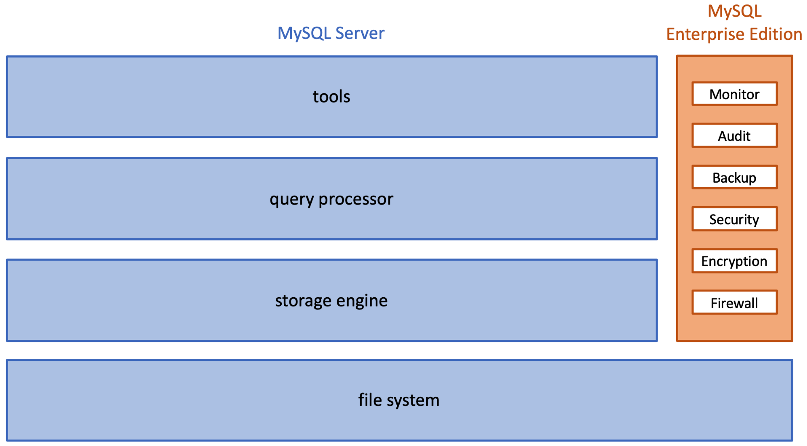

# Chapter 7: Database Architecture

## 7.1: MySQL architecture
### Layers
- **Architecture** describes the components of a computer system and the relationships between the components
- MySQL components are organized in four layers
  - **Tools** interact directly with database users and administrators, sending queries to the query processor
  - **Query processor** managers connections from multiple users and compiles queries into low-level instructions for the storage engine
  - **Storage engine** (or **storage manager**) executes instructions, manages indexes, and interacts with the file system. Some storage engines support database transactions
  - **File system** accesses data on storage media and can contain both system and user data, log files, tables, and indexes
  - 
### Tools
- Tools layer includes connectors and APIs, Workbench, and utility programs
- **Utility programs** include ~30 tools, which are grouped into five categories, installation, client, administrative, developer, and miscellaneous. Most of these programs are intended for database administrators or programmers
- The Command-Line Client (CLI) is particularly important
### Query Processor
- The query processor layer has two main functions, managing connections and compiling queries
- **Connection** is a link between tools and the query processor. Each connection specifies a database name, server, login name/password. A connection manager then creates connections and manages communication between tools and the query parser
- Query compilation generates a query execution plan. An **execution plan** is a detailed, low-level sequence of steps that specify exactly how to process a query
- The query processor generates execution plans in two steps
  1. **Query parser** checks the query for syntax errors, then converts valid queries into internal representation
  2. **Query optimizer** reads the internal representation, generates alternative execution plans, estimates execution times, then selects the fastest plan. These estimates are based on heuristics/statistics about the data (number of rows in a table, number of values in each column, etc.)
- Query processor has a **cache manager** to optimize performance and reuse information in main memory
### Storage engine
- Storage engine layer has two main functions, transaction management and data access
- Transaction management includes the concurrency system, recovery system, and lock manager. These ensure all transactions are atomic, consistent, isolated, and durable
- Data access component communicates with the file system and translates table, column and index reads into block addresses
- A **buffer manager** may retain data blocks from the file system for possible reuse to reduce data access time. These blocks are stored in an area of the main memory called the **buffer**. This buffer manager is similar to the cache manager of the query processor layer
- A buffer manager has a fixed amount of memory, with an algorithm such as **least recently used** (or **LRU**) determining which blocks to retain and which to discard
  - The LRU algorithm tracks the time each block was last accessed and, when space is needed, discards "stale" blocks
- MySQL supports different storage engines, each of which is optimized for a specific application (like transaction management or analytics)
### File system
- The file system consists of data stored on storage media and organized in files
- File system contains three types of data for each database, user data, log files, and a data dictionary
  - User data: includes tables and indexes
  - Log files: contain detailed, sequential records of each change applied to a database, which can be used by the recovery system
  - **Catalog**/**data dictionary**: a directory of tables/columns/keys/indexes/other objects in a relational database
- MySQL data dictionary contains ~30 tables, including
  - `tables` describes all tables
  - `table_stats` contains table statistics, such as the number of rows in each table
  - `columns` describes all columns
  - `foreign_keys` describes all foreign keys
  - `indexes` describes all indexes
  - `routines` describes all stored procedures and stored functions 
  - `triggers` describes all triggers
- These tables cannot be accessed directly with `SELECT`, `INSERT`, `UPDATE`, or `DELETE` queries, instead have to be queried indirectly